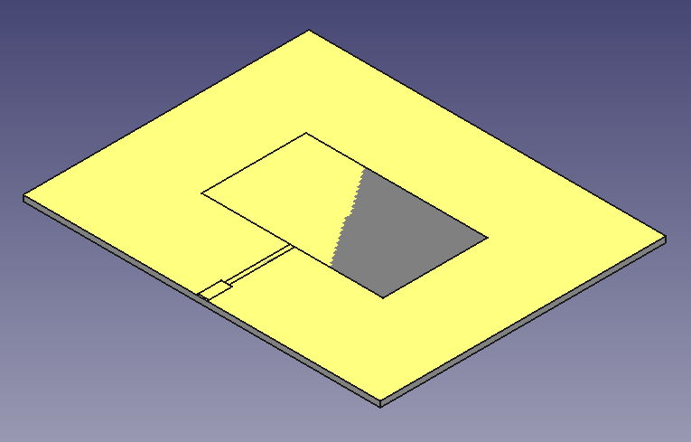
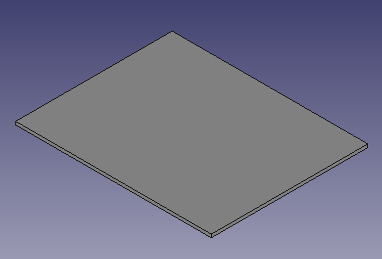
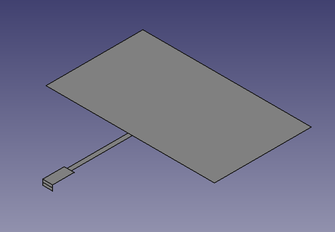

## igeswrite

igeswrite is a Python 3 library for creating 
IGES files.  IGES is a standard for exchanging solid
among other models first published in 1980.
![https://en.wikipedia.org/wiki/IGES].  Most simulation
RF software like FEKO, HFSS, and CTS support importing
IGES files.   



The DXF format, though it is a well known
format and works in 3D, does not really support 
models for solids, like a plane much less a cube.  
DXF can be imported into SONNET however as 2D.

igesswrite supports the following models: 1) lines,
2) xz planes, 3) yz planes, 4) xz planes, and 5) cubes.

The following are the methods provided by the
library class.  Use the write() method to save your work 
to a file or print it to standard output.  See the 
files microstrip.py and patch.py for examples.

```
Iges.write(self, filename=None)
    - save models to filename or print to standard output if ungiven
Iges.line(self, points, origin=(0,0,0))
    - points is given as a list [ax, ay, az, bx, by, bz]
Iges.xzplane(self, w, h, origin=(0,0,0))
Iges.yzplane(self, w, h, origin=(0,0,0))
Iges.plane(self, w, h, origin=(0,0,0))
    - w, h is the width and height of the plane in 2D
Iges.cube(self, w, l, h, origin=(0,0,0))
    - w, l, h is the width, length and height of the plane in 3D
```

For example to create a PCB board try:


```
from igeswrite import Iges
bw = 100   # PCB board width in mm
bl = 80    # PCB board length in mm
h = 1.6    # PCB board thickness in mm

cx = bw / 2
cy = bl / 2
iges = Iges()

# board
iges.cube(bw, bl, -h, origin=(-cx, -cy, 0))
iges.write()
```

This creates the following model:



To add a patch antenna with microstrip, including the connection 
to ground for the port, to the board use:

```
iges = Iges()

l = 29.2   # length of patch
w = 50.8   # width of patch
dw = 1.3   # width of quarter wave line
dl = 18    # length of quarter wave line
zw = 3.0   # width of 50 ohm line
de = 0.5   # offset from edge
ext = h * .44 * (1 - dw / zw) 

# patch antenna
iges.plane(w, l, origin=(-w/2, -l/2, 0))

# transmission line
d0 = l/2 + dl + ext
d1 = cy - de
iges.plane(dw, dl + ext, origin=(-dw/2, -d0, 0))
iges.plane(zw, d1 - d0, origin=(-zw/2, -d1, 0))

# edge port
iges.xzplane(zw, -h/2, origin=(-zw/2, -d1, 0))
iges.xzplane(zw, -h/2, origin=(-zw/2, -d1, -h/2))
iges.write()
```


